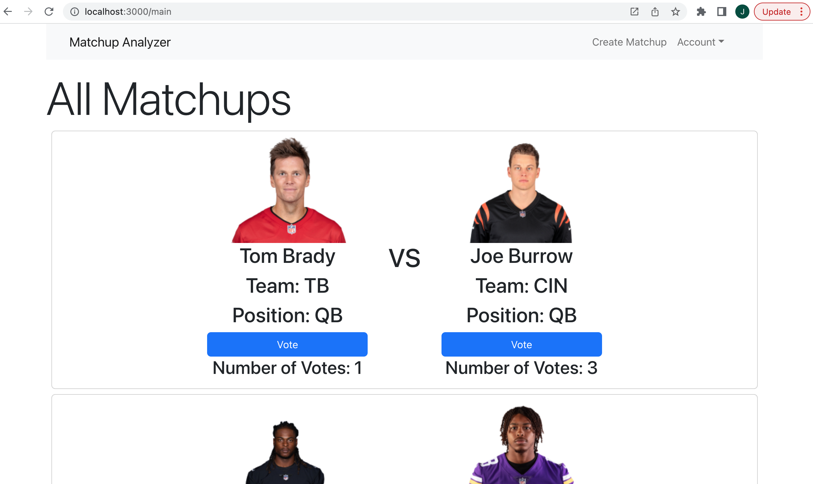

# Fantasy Football Matchup Analyzer 
## Table of Contents
* [Description](#description)
* [Usage](#usage)
* [Contributing](#contributing)
* [License](#license)
* [Questions](#questions)
* [Media](#media)
## Description
This application allows users, after they create an account, to view and create matchups of NFL players, vote on those matchups to provide input on who they think should be started that week, and the users can delete their own matchups if they no longer are thinking about which player is the better one to start. This program uses the MERN stack - MongoDB, Express, React and Node.js. The program also uses GraphQL. It uses queries and mutations for retrieving, adding, updating and deleting data. It has a polished UI, using Bootstrap. It is deployed to Heroku, and it is interactive, responsive, and includes authentication by way of JSON Web Token (JWT). 
## Usage
Users will create an Account from the Sign Up page after the initial page. After creating an account, they will be able to view the main page, and they can go to Create Matchup to make their own matchups for the main page. They can navigate to the My Matchups page to delete their matchups. They can also vote on the main page.
## Contributing
Carl Bergquist, Harrison Cooper, and Jack Warrick
## License
This application is covered under the MIT License.
## Questions
For more information, please reference the GitHub profile [here](https://github.com/CarlBergquist), or reach out to my email: j.d.warrick@comcast.net.
## Media
[Link to Deployed application](https://blooming-hollows-39253.herokuapp.com/)
-----
**Screenshot of main page of program:**
